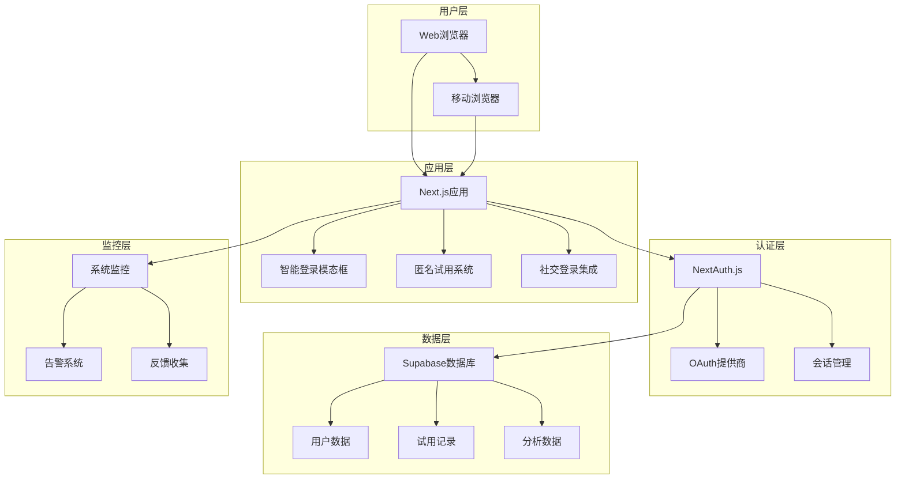

# 智能登录系统文档中心

欢迎来到智能登录系统的文档中心。这里包含了系统的完整技术文档、部署指南、故障排除和维护信息。

## 📚 文档目录

### 核心文档

1. **[智能登录系统技术文档](./SMART_LOGIN_SYSTEM.md)**
   - 系统架构和设计理念
   - 核心功能模块详解
   - 技术栈和组件说明
   - API接口文档
   - 数据模型设计

2. **[OAuth配置和部署指南](./OAUTH_DEPLOYMENT_GUIDE.md)**
   - GitHub/Google OAuth配置
   - 环境变量设置
   - 数据库配置
   - 部署流程和检查清单
   - 安全配置最佳实践

3. **[常见问题和故障排除](./TROUBLESHOOTING_FAQ.md)**
   - 常见问题解答
   - 故障诊断流程
   - 错误代码说明
   - 性能优化建议
   - 监控和告警配置

## 🚀 快速开始

### 新手指南

如果你是第一次接触这个系统，建议按以下顺序阅读文档：

1. 先阅读 [技术文档](./SMART_LOGIN_SYSTEM.md) 了解系统整体架构
2. 参考 [部署指南](./OAUTH_DEPLOYMENT_GUIDE.md) 进行环境配置
3. 遇到问题时查阅 [故障排除文档](./TROUBLESHOOTING_FAQ.md)

### 开发者快速上手

```bash
# 1. 克隆项目
git clone <repository-url>
cd youtube-scraper

# 2. 安装依赖
npm install

# 3. 配置环境变量
cp .env.example .env.local
# 编辑 .env.local 文件，填入必要的配置

# 4. 运行数据库迁移
npm run db:migrate

# 5. 启动开发服务器
npm run dev
```

## 🏗️ 系统架构概览



## 📋 功能特性

### ✅ 已实现功能

- **匿名试用系统** - 基于浏览器指纹的试用次数管理
- **智能登录触发** - 根据用户行为智能提示登录
- **多种登录方式** - 支持GitHub、Google、邮箱登录
- **移动端适配** - 响应式设计，支持各种设备
- **会话管理** - 安全的令牌管理和自动刷新
- **错误处理** - 完善的错误恢复机制
- **性能监控** - 实时系统健康监控
- **用户反馈** - 完整的反馈收集和处理系统

### 🔄 持续改进

- 多因素认证 (MFA)
- 单点登录 (SSO)
- 更多OAuth提供商
- 高级分析仪表板
- 国际化支持

## 🛠️ 开发工具和环境

### 必需工具

- **Node.js** >= 18.0.0
- **npm** >= 8.0.0
- **Git** >= 2.30.0

### 推荐工具

- **VS Code** - 代码编辑器
- **Postman** - API测试
- **Chrome DevTools** - 调试工具

### 开发环境配置

```bash
# 检查Node.js版本
node --version

# 检查npm版本
npm --version

# 安装全局工具
npm install -g @supabase/cli
npm install -g vercel
```

## 📊 监控和分析

### 关键指标

- **登录成功率** - 目标: >95%
- **试用转化率** - 目标: >15%
- **API响应时间** - 目标: <2秒
- **用户满意度** - 目标: >4.5/5

### 监控端点

- `/api/monitoring/health` - 系统健康检查
- `/api/monitoring/metrics` - 性能指标
- `/api/monitoring/alerts` - 告警信息

## 🔧 维护和支持

### 定期维护任务

- **每日**: 检查系统日志和错误率
- **每周**: 清理过期数据，更新依赖
- **每月**: 性能评估和安全审计
- **每季度**: 架构回顾和优化

### 获取帮助

1. **查阅文档** - 首先查看相关文档
2. **搜索问题** - 在GitHub Issues中搜索
3. **提交Issue** - 创建新的问题报告
4. **联系团队** - 发送邮件至 dev-team@your-domain.com

## 📝 贡献指南

### 代码贡献

1. Fork项目仓库
2. 创建功能分支: `git checkout -b feature/new-feature`
3. 提交更改: `git commit -am 'Add new feature'`
4. 推送分支: `git push origin feature/new-feature`
5. 创建Pull Request

### 文档贡献

- 发现文档错误或不清楚的地方，欢迎提交PR
- 添加新功能时，请同步更新相关文档
- 遵循现有的文档格式和风格

## 📄 许可证

本项目采用 MIT 许可证。详见 [LICENSE](../LICENSE) 文件。

## 🔗 相关链接

- **项目仓库**: [GitHub Repository](https://github.com/your-org/youtube-scraper)
- **在线演示**: [Demo Site](https://your-demo-site.com)
- **API文档**: [API Documentation](https://api-docs.your-domain.com)
- **状态页面**: [System Status](https://status.your-domain.com)

---

**文档版本**: v1.0  
**最后更新**: 2025-01-03  
**维护者**: 开发团队

如有任何问题或建议，请通过以下方式联系我们：
- 📧 Email: dev-team@your-domain.com
- 💬 Slack: #dev-team
- 🐛 Issues: [GitHub Issues](https://github.com/your-org/youtube-scraper/issues)