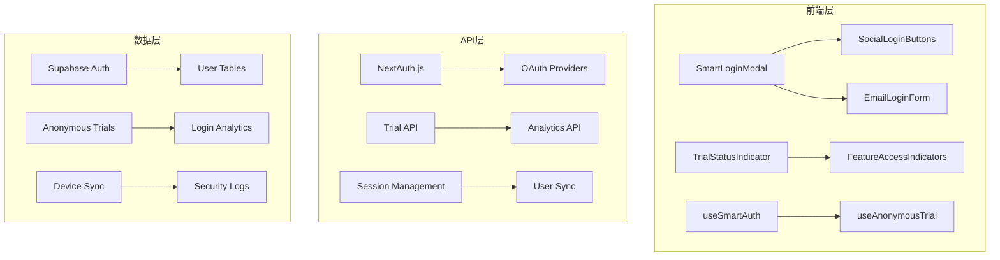

# 智能登录系统技术文档

## 概述

智能登录系统是一个基于NextAuth.js的现代认证解决方案，实现了"先体验后注册"的用户体验模式。系统允许用户在匿名状态下体验核心功能，并在适当时机智能引导用户完成认证。

## 系统架构

### 核心组件



### 技术栈

- **认证核心**: NextAuth.js v4 + Supabase Adapter
- **前端框架**: Next.js 15 + React 18
- **UI组件**: Radix UI + Tailwind CSS
- **状态管理**: React Context + Custom Hooks
- **数据库**: Supabase PostgreSQL
- **指纹识别**: FingerprintJS2
- **测试**: Jest + React Testing Library + Playwright

## 核心功能模块

### 1. 匿名试用系统

**文件位置**: `src/lib/fingerprint.ts`, `src/hooks/useAnonymousTrial.ts`

```typescript
// 核心接口
interface TrialStatus {
  remaining: number;
  total: number;
  fingerprint: string;
  lastUsed: Date;
  actions: TrialAction[];
}

// 使用示例
const { trialStatus, consumeTrial, canUseTrial } = useAnonymousTrial();
```

**特性**:
- 基于浏览器指纹的设备识别
- 本地存储 + 服务端验证的双重机制
- 防刷机制（IP + 指纹 + 时间窗口）
- 渐进式试用提醒

### 2. 智能登录触发

**文件位置**: `src/hooks/useSmartAuth.ts`, `src/lib/feature-access-control.ts`

```typescript
// 智能检查功能访问权限
const { requireAuth, checkFeatureAccess } = useSmartAuth();

// 使用示例
const handleSaveReport = async () => {
  const canProceed = await requireAuth('save_report', {
    message: '保存分析报告需要登录账户',
    urgency: 'medium'
  });
  
  if (canProceed) {
    // 执行保存操作
  }
};
```

**触发场景**:
- 试用次数耗尽
- 保存/导出功能
- 高级分析功能
- 团队协作功能
- 个人设置访问

### 3. 社交登录集成

**文件位置**: `src/app/api/auth/[...nextauth]/route.ts`

支持的OAuth提供商:
- GitHub (适合开发者用户)
- Google (通用用户)
- 邮箱密码登录 (降级方案)

```typescript
// NextAuth.js 配置
export const authOptions: NextAuthOptions = {
  providers: [
    GitHubProvider({
      clientId: process.env.GITHUB_ID!,
      clientSecret: process.env.GITHUB_SECRET!,
    }),
    GoogleProvider({
      clientId: process.env.GOOGLE_CLIENT_ID!,
      clientSecret: process.env.GOOGLE_CLIENT_SECRET!,
    }),
  ],
  adapter: SupabaseAdapter({
    url: process.env.NEXT_PUBLIC_SUPABASE_URL!,
    secret: process.env.SUPABASE_SERVICE_ROLE_KEY!,
  }),
  // ... 其他配置
};
```

### 4. 会话管理

**文件位置**: `src/lib/session-manager.ts`, `src/hooks/useSessionManager.ts`

**特性**:
- JWT令牌 + 数据库会话双重验证
- 自动令牌刷新机制
- 跨标签页状态同步
- 会话过期友好提示
- 多设备登录管理

### 5. 移动端适配

**文件位置**: `src/components/auth/SmartLoginModal.tsx`

**适配策略**:
- 响应式模态框布局
- 底部抽屉式设计 (移动端)
- 触摸友好的按钮尺寸
- OAuth跳转优化
- 键盘导航支持

## 数据模型

### 核心表结构

```sql
-- NextAuth.js 标准表
accounts, sessions, users, verification_tokens

-- 扩展用户表
yt_users (
  nextauth_user_id TEXT,
  avatar_url TEXT,
  display_name VARCHAR(255)
)

-- 匿名试用跟踪
yt_anonymous_trials (
  fingerprint VARCHAR(255),
  trial_count INTEGER,
  actions JSONB,
  converted_user_id UUID
)

-- 登录分析
yt_login_analytics (
  event_type VARCHAR(50),
  trigger_type VARCHAR(50),
  provider VARCHAR(50),
  context JSONB
)

-- 设备同步
yt_user_devices (
  device_fingerprint VARCHAR(255),
  device_info JSONB,
  last_sync_at TIMESTAMP
)
```

## API端点

### 认证相关
- `GET /api/auth/session` - 获取当前会话
- `POST /api/auth/signin/[provider]` - 社交登录
- `POST /api/auth/signout` - 登出

### 试用管理
- `POST /api/trial/consume` - 消耗试用次数
- `GET /api/trial/status` - 获取试用状态

### 分析统计
- `GET /api/auth/analytics/stats` - 登录统计
- `GET /api/auth/analytics/funnel` - 转化漏斗
- `POST /api/auth/analytics/track` - 事件追踪

### 用户管理
- `POST /api/user/sync` - 用户数据同步
- `GET /api/device/info` - 设备信息
- `POST /api/device/sync` - 设备同步

## 安全特性

### 1. 认证安全
- CSRF保护 (NextAuth.js内置)
- PKCE流程 (OAuth 2.1标准)
- 状态参数验证
- 安全的令牌存储

### 2. 试用防刷
- 浏览器指纹识别
- IP地址限制
- 时间窗口检测
- 行为模式分析

### 3. 会话安全
- HttpOnly Cookie
- 安全的令牌刷新
- 异常登录检测
- 设备管理功能

### 4. 隐私保护
- GDPR合规设计
- 用户数据控制
- 匿名化处理
- 数据删除功能

## 性能优化

### 1. 前端优化
- 组件懒加载
- 状态缓存机制
- 防抖处理
- 内存泄漏防护

### 2. API优化
- 请求去重
- 响应缓存
- 批量操作
- 连接池管理

### 3. 数据库优化
- 索引优化
- 查询优化
- 连接池配置
- 定期清理任务

## 监控和告警

### 关键指标
- 登录成功率
- 试用转化率
- API响应时间
- 错误率统计
- 会话活跃度

### 告警规则
- 登录失败率 > 10%
- API响应时间 > 2s
- 数据库连接数 > 80%
- 异常登录行为检测

## 故障排除

### 常见问题
1. **OAuth回调失败** - 检查回调URL配置
2. **会话过期** - 检查令牌刷新机制
3. **试用次数异常** - 检查指纹生成逻辑
4. **移动端登录问题** - 检查OAuth跳转处理

### 调试工具
- 开发者控制台日志
- NextAuth.js调试模式
- Supabase日志查看
- 自定义错误追踪

## 部署和配置

### 环境变量
```bash
# NextAuth.js
NEXTAUTH_URL=https://your-domain.com
NEXTAUTH_SECRET=your-secret-key

# OAuth Providers
GITHUB_ID=your-github-client-id
GITHUB_SECRET=your-github-client-secret
GOOGLE_CLIENT_ID=your-google-client-id
GOOGLE_CLIENT_SECRET=your-google-client-secret

# Supabase
NEXT_PUBLIC_SUPABASE_URL=your-supabase-url
SUPABASE_SERVICE_ROLE_KEY=your-service-role-key
```

### 部署检查清单
- [ ] 环境变量配置完整
- [ ] OAuth应用回调URL正确
- [ ] 数据库迁移执行完成
- [ ] SSL证书配置正确
- [ ] 监控告警设置完成

## 维护指南

### 定期维护任务
- 清理过期会话数据
- 更新OAuth应用配置
- 检查安全漏洞
- 性能指标分析
- 用户反馈处理

### 版本升级
- NextAuth.js版本兼容性检查
- 数据库迁移脚本准备
- 回滚方案制定
- 灰度发布策略

## 开发指南

### 本地开发环境搭建
1. 克隆项目代码
2. 安装依赖: `npm install`
3. 配置环境变量
4. 运行数据库迁移
5. 启动开发服务器: `npm run dev`

### 测试策略
- 单元测试: Jest + React Testing Library
- 集成测试: API端点测试
- 端到端测试: Playwright
- 性能测试: Lighthouse CI

### 代码规范
- TypeScript严格模式
- ESLint + Prettier
- 组件文档注释
- 错误边界处理

## 扩展功能

### 未来规划
- 多因素认证 (MFA)
- 单点登录 (SSO)
- 企业级权限管理
- 高级分析仪表板
- 国际化支持

### 集成建议
- 第三方分析工具
- 客户支持系统
- 邮件营销平台
- 支付系统集成

---

**文档版本**: v1.0  
**最后更新**: 2025-01-03  
**维护者**: 开发团队